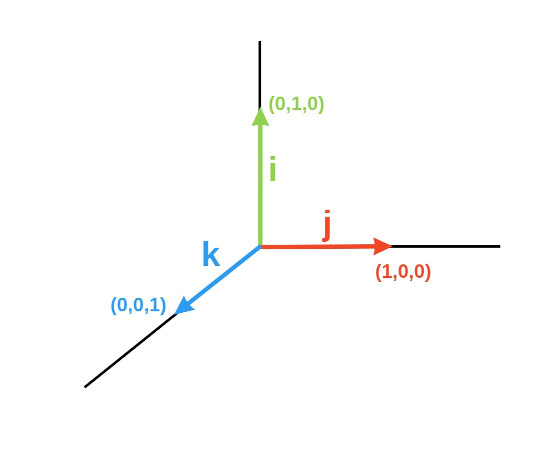
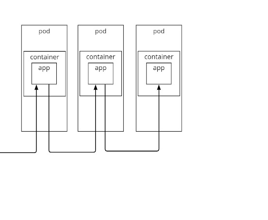
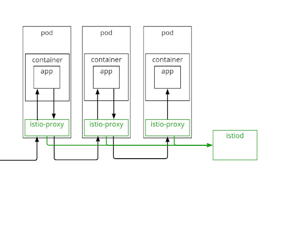
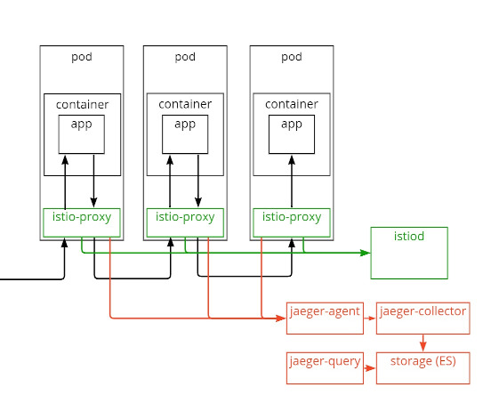
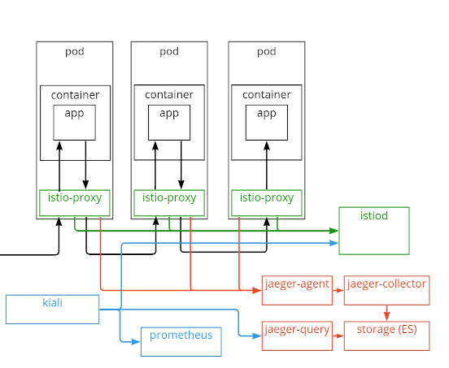

## How to setup monitoring in kubernetes under 15 minutes

<!--s-->

# Situation

* An application built in microservice architecture... <!-- .element: class="fragment" -->
* ...built by juniors<!-- .element: class="fragment" -->
* It seems to work fine...<!-- .element: class="fragment" -->
* ...but has absolutely no logs<!-- .element: class="fragment" -->
* It gets extremely slow on production...<!-- .element: class="fragment" -->
* ...and we have no way to replicate this on test env<!-- .element: class="fragment" -->

<!--s-->

# \*\*\* stack

Three-letter stack for monitoring?
<div>
    <!-- .element: class="fragment" -->
    <!-- .element: class="fragment" -->
</div>

<!--s-->

# IJK stack


<!--s-->
# 'I' is for Istio

## What?

Istio extends Kubernetes to establish a programmable, application-aware network using the powerful Envoy service proxy. <!-- .element: class="fragment" -->

<div>see:
* [Istio](https://istio.io)
</div><!-- .element: class="fragment" -->

<!--v-->
# 'I' is for Istio

## What?


<!--v-->
# 'I' is for Istio

## What?


<!--v-->
# 'I' is for Istio

## How?

```
curl -L https://istio.io/downloadIstio | sh -
istio-1.XX.X/bin/istioctl install -y
kubectl label namespace ${namespace} istio-injection=enabled
kubectl -n ${namespace} rollout restart `kubectl -n ${namespace} get deploy -o name`
```
see:
* [Istio - getting started](https://istio.io/latest/docs/setup/getting-started/)

<!--s-->
# 'J' is for Jaeger

## What?

<div>
Jaeger is a distributed tracing system released as open source by Uber Technologies. It is used for monitoring and troubleshooting microservices based distributed systems
</div><!-- .element: class="fragment" -->
<div>see:
* [Jaeger](https://www.jaegertracing.io/)
</div><!-- .element: class="fragment" -->

<!--v-->
# 'J' is for Jaeger

## What?


<!--v-->
# 'J' is for Jaeger

## What?


<!--v-->
# 'J' is for Jaeger

## How?

```
kubectl apply -f https://raw.githubusercontent.com/istio/istio/release-1.XX/samples/addons/jaeger.yaml
istio-1.XX.X/bin/istioctl install -y \
  --set meshConfig.defaultConfig.tracing.zipkin.address=jaeger-collector.istio-system:9411 \
  --set meshConfig.defaultConfig.tracing.sampling=100.0
kubectl -n ${namespace} rollout restart `kubectl -n ${namespace} get deploy -o name`
```
```
istio-1.XX.X/bin/istioctl dashboard jaeger
```
see:
* [Istio - jaeger](https://istio.io/latest/docs/tasks/observability/distributed-tracing/jaeger/)
* [Jaeger - operator](https://www.jaegertracing.io/docs/1.34/operator/)

<!--s-->
# 'K' is for Kiali

Kiali is a management console for Istio service mesh. Kiali can be quickly installed as an Istio add-on, or trusted as a part of your production environment.

<div>
see:
* [Kiali](https://kiali.io/)
</div><!-- .element: class="fragment" -->

<!--v-->
# 'K' is for Kiali

## What?


<!--v-->
# 'K' is for Kiali

## What?


## How?

```
kubectl apply -f https://raw.githubusercontent.com/istio/istio/release-1.13/samples/addons/prometheus.yaml
kubectl apply -f https://raw.githubusercontent.com/istio/istio/release-1.13/samples/addons/kiali.yaml

```
```
istio-1.XX.X/bin/istioctl dashboard kiali
```
see:
* [Istio - kiali](https://istio.io/latest/docs/tasks/observability/kiali/)
<!--s-->
# What's next?


<!--v-->
# What's next?

Istio
* not just monitoring
* traffic management<!-- .element: class="fragment" -->
* telemetry<!-- .element: class="fragment" -->
* security<!-- .element: class="fragment" -->

<!--v-->
# What's next?

Jaeger
* Span propagation
* Connect spans within single flow<!-- .element: class="fragment" -->
* Log traceId<!-- .element: class="fragment" -->

<!--v-->
# What's next?

Dashboards
* Expose jaeger/kiali dashboard

<!--s-->
# Thank you

see:
* https://github.com/RemboL/ijk-stack
* https://RemboL.github.io/ijk-stack/docs/
